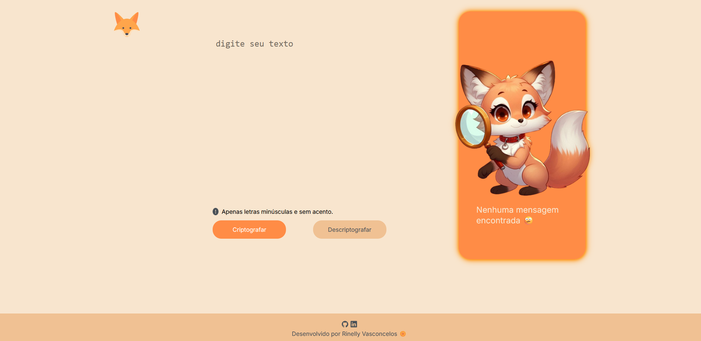
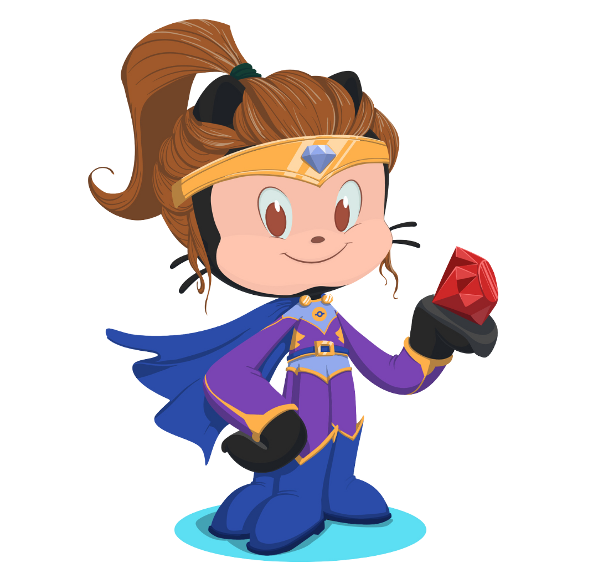

# Olá, sejam bem vindos! 😃 

<h1 style="color:orange">Decoder Fox 🦊</h1>

<h3>▪️ O codificador e decodificador de textos</h3>

Esse é um projeito para entrega do Challenge do curso de formação de iniciantes em programação através da Oracle em parceria com a Alura. 

O obejtivo do desafio é criar um programa para criptografar e descriptografar textos seguindo as instruções do desafio.

<h3>▪️ As "chaves" que foram utilizadas para a criptografia: 🗝️</h3> <br>

A letra "e" é convertida para "enter"<br>
A letra "i" é convertida para "imes"<br>
A letra "a" é convertida para "ai"<br>
A letra "o" é convertida para "ober"<br>
A letra "u" é convertida para "ufat"<br>

<h2 style="color:orange">▪️ Tema - Raposa 🦊</h2> <br>

Para desenvolver o programa usei como base o layout do figma fornecido pela Alura, porém personalizei o esquema de cores e imagens, para isso escolhi a paleta de cores baseada no <span style="color:orange">laranja</span> e a imagem de uma raposa segurando uma lupa, criada por IA. 
<br><br>

<br> 

<h2>▪️ Tecnologias utilizadas: 💻</h2>

    

<br>

Para desenvolvimento do programa, utilizei HTML, CSS e JavaScript. Aproveitei para colocar alguns estudos recentes em prática, como o uso de arrow function e funções assíncronas. <br>
<h3>▪️ Explicando as funções no JavaScript</h3>
<br>

-```exibirTextoSaida(tag, texto)```<br> 
Função para exibir textos de saída;<br>

-```output()```<br>
Função para ocultar a imagem, limpar o h3 e mostrar o botão de copiar;<br>

-```removeDiacritics(str)```<br>
Função para remover diacríticos;<br>

-```criptografar()```<br>
Funções para criptografar o texto;<br>

-```descriptografar()```<br>
Função para descriptografar o texto;<br>

-```botaoCopiarTexto()```<br>
Função para copiar o texto de saída para a área de transferência;<br>


Link do programa: https://decoder-fox.vercel.app/

<hr>


<h3>&#128241; Conecte-se comigo:</h3> 

[](https://www.linkedin.com/in/rinelly-vasconcelos-989297142/)
[](https://discord.com/channels/@ri.monique)
[](https://www.instagram.com/rinellyvasconcelos/)
[](https://github.com/Rinelly)

 <br>
<span> "Você não pode mudar o vento, mas pode ajustar as velas do barco para chegar onde quer." - Confúcio</span>
